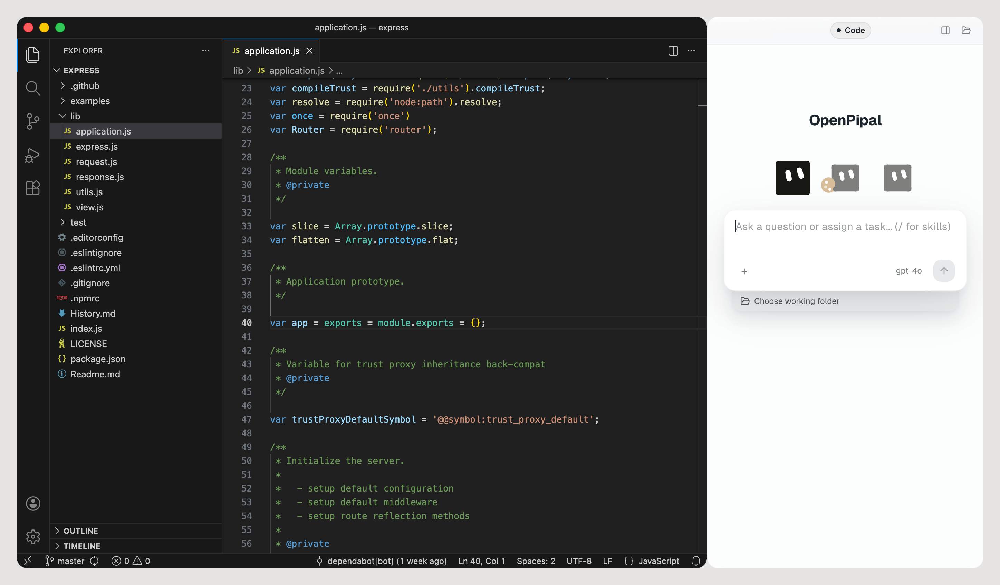

# OpenPipal

> Open-source visual Agent app for macOS. No terminal required — connect a model and start.

<p align="center">
  <a href="https://github.com/yuanlang12/OpenPipal/releases/latest">
    
  </a>
  
  <a href="LICENSE"></a>
</p>

<p align="center">English · <a href="README.zh-CN.md">简体中文</a></p>

<p align="center">
  
</p>

For every job, a dedicated Agent. Tell OpenPipal once how a piece of work should be done and
it becomes an Agent with its own instructions, memory, skills and tasks — ready the next time
you need it, or running on a schedule while you're not there.

**It ships no model of its own.** Every request goes straight from your Mac to an
OpenAI-compatible endpoint that you configure — your key, your provider, your bill.
Nothing is proxied through an OpenPipal server, because there isn't one.

---

## What's in this release

This repository carries three built-in agents: the **default OpenPipal Agent**, the **Design Assistant** and the **Coding Assistant**.

Four further built-in agents (Learner, Teacher, Office, Interpreter) are not part of this
open-source release. Custom agents, skills, MCP servers, memory and the browser extension are
all unaffected.

The published tree is cut from our working repository by
[`scripts/make-open-source-cut.mjs`](scripts/make-open-source-cut.mjs), driven by
[`config/open-source-policy.json`](config/open-source-policy.json). Every excluded path is
listed in `OPEN-SOURCE-CUT.json` — the cut is reproducible, not hand-curated.

---

## Install

### Desktop

1. Grab the `.dmg` for your Mac from [Releases](https://github.com/yuanlang12/OpenPipal/releases/latest)
   (separate builds for Apple Silicon and Intel), then drag `OpenPipal.app` into `Applications`.
2. **First launch: macOS will refuse to open it.** These builds carry an ad-hoc signature
   rather than an Apple Developer ID, so Gatekeeper blocks them — and since macOS 15,
   right-clicking → Open no longer gets past it. Dismiss the dialog, open **System Settings
   → Privacy & Security**, scroll down to *Security*, and click **Open Anyway** on the
   OpenPipal line. From a terminal it is one command instead:

   ```sh
   xattr -dr com.apple.quarantine /Applications/OpenPipal.app
   ```

3. **Permissions come up only when a feature needs them.** macOS asks the first time, or you
   can add OpenPipal yourself under **System Settings → Privacy & Security**:

   - **Accessibility** — only if you turn on app following (Settings → Apps), so the panel
     can dock beside the frontmost window
   - **Screen Recording** — look at a window when you ask it to
   - **Automation** — focus and paste into the application you picked
   - **Microphone** — only if you use voice input

   macOS ties these grants to an application's code signature, and an ad-hoc signature
   changes with every build. So after installing a new version you may find the old entry
   stale and have to remove it and grant again. A notarized build removes that chore.

4. Open **Settings → Models**, click **Add provider** and fill in the Base URL and API key, then
   **Add model** under it with the model name. **Test connection** tells you on the spot whether
   the two work together.

The first launch opens a short tour — three screens, skippable, and replayable any time from
**Settings → About**. It shows what OpenPipal can do but configures nothing, so the model still
has to be added as in step 4.

### Browser extension (optional)

1. Download `openpipal-extension-*.zip` from the same release and unzip it anywhere.
2. Open `chrome://extensions` in Chrome, Edge or Brave and turn on **Developer mode**.
3. Choose **Load unpacked** and select the unzipped folder.

The extension shares one AI instance with the desktop app and talks to it over
`localhost:3031`, so **the desktop app has to be running**.

---

## Model providers

Anything that speaks the OpenAI-compatible protocol works. Presets included:

| Provider | Base URL | Example model |
|---|---|---|
| OpenAI | `https://api.openai.com/v1` | `gpt-4o` |
| DeepSeek | `https://api.deepseek.com` | `deepseek-chat`, `deepseek-reasoner` |
| OpenRouter | `https://openrouter.ai/api/v1` | `anthropic/claude-sonnet-4` |
| SiliconFlow | `https://api.siliconflow.cn/v1` | `Qwen/Qwen2.5-72B-Instruct` |
| Ollama (local) | `http://localhost:11434/v1` | whatever you've pulled |

---

## What it does

- **Dedicated Agents** — save any conversation as an Agent with **Save as Agent**, or build
  one on the **My Agents** page: its own instructions, look, memory and tasks. One job, one
  Agent.
- **Plugins, Skills, MCP and CLI tools** — extend an Agent with standard plugins
  (`plugin.json` + Skills + MCP servers); the bundled Skills cover documents, PDFs, slides and
  spreadsheets, plus a skill creator and a tool installer (type `/` in the composer to use
  one); any Model Context Protocol server connects, with Context7 and DeepWiki as presets; and
  the command-line tools already on your Mac, such as `gh`, `node` and `npm`, are available
  as tools.
- **Automation** — run a task once, or keep it running on a cron-style schedule or a webhook,
  each run in a fresh conversation or accumulating in one.
- **Subagents** — an Agent can split a job across Subagents, and each Subagent's conversation
  can be expanded to see exactly what it did.
- **Works** — everything Agents produce, collected in one place; the Visualizer renders cards,
  charts, whiteboards and Mermaid diagrams live as the model writes them.
- **Long-term memory** — per-agent, opt-in, stored as plain Markdown you can read and edit.
- **Design it once, reuse it everywhere** — any editor that speaks the open
  [Agent Client Protocol](https://agentclientprotocol.com) can point at OpenPipal as its agent
  server (the adapter ships inside the app; the launch command is under **Settings →
  Connections**), and any other program gets a local HTTP interface.
- **Browser side panel** — the same assistant, inside Chrome, Edge or Brave.
- **Design Assistant** — turns a brief into finished posters, slides and other visual
  deliverables, then keeps editing them with you.
- **Coding Assistant** — the built-in agent that works inside your repository (below).
- **App following, if you want it** — off by default. Turn it on under **Settings → Apps** and
  OpenPipal docks itself beside whatever app you switch to; you can leave individual apps out.

Keep the model at the center; add complexity only when needed. OpenPipal is a minimal Agent
core built on the open-source Pi agent framework, with controlled context and only the tools
the work actually needs — and everything it plugs into is an open standard: ACP, MCP, Agent
Skills and Agent Plugins.

### Coding Assistant

Switch to **Coding Assistant** in the agent picker and it asks one question first: which
repository are we working in? From there it behaves like a careful new hire rather than a
know-it-all:

- **Reads the project's own rules before touching code.** `AGENTS.md` (the open standard that
  Codex, Cursor, Amp and Jules read too), `AGENTS.override.md` or `CLAUDE.md` in the working
  directory goes straight into its context. A repository with none gets an `AGENTS.md` drafted
  from commands it has actually run — shown to you before anything is written.
- **Precise edits, then the project's own tests and build** — never a whole-file rewrite.
- **You decide how much it may do, per conversation.** *Read only* looks and never changes
  (reads code, searches, browses — no writing files, no running commands). *Ask when needed*
  is the default and asks once before changing a file or running a command. *Allow all* stops
  asking for edits and commands; deleting, resetting and force-pushing still ask once.
- **Commands run inside a macOS sandbox** (Seatbelt, via `@anthropic-ai/sandbox-runtime`)
  confined to the working directory, with credential files unreadable. Before it uses your git
  credentials against a remote it asks once per project; inside the sandbox remotes are reached
  over HTTPS.
- **An error screenshot and a reference folder** can be attached up front — the stack trace
  from your terminal, or a second repository it may read but not modify.

---

## Your data stays on your machine

```
~/.openpipal/
├── config.json     # model presets and app settings
├── memory/         # long-term memory, one folder per agent
├── outputs/        # files the model produced
├── sessions-v4/    # chat history, append-only JSONL
├── conversations/  # attachments, plus history from older versions
└── skills/         # your own skills
```

API keys live in `config.json` on your disk and are never uploaded. Deleting `~/.openpipal/`
removes everything.

---

## Build from source

Requires macOS, Node.js 22.19+ and npm.

```bash
npm ci
npx electron-vite build
npx electron .                   # run the built app
```

Checks:

```bash
npx tsc --noEmit -p tsconfig.node.json   # main process
npx tsc --noEmit -p tsconfig.web.json    # renderer
npx vitest run                           # unit tests
npx playwright test                      # end-to-end
```

`npm run dev` gives you the usual hot-reload loop. Packaging is
`npx electron-builder --config electron-builder.yml`; note that builds produced this way are
unsigned and unnotarized.

### Layout

| Path | What lives there |
|---|---|
| `src/main/` | Electron main process — agent runtime, tools, IPC, window docking |
| `src/renderer/` | React UI, shared by the desktop app and the browser panel |
| `src/preload/` | The IPC bridge between them |
| `src/shared/` | Contracts and the i18n catalogue used by both sides |
| `openpipal-extension/` | Chrome extension |
| `resources/skills/` | Bundled skills |
| `docs/` | Architecture and security notes |

The renderer talks to the main process over preload IPC on the desktop, and over an
HTTP/SSE shim on `:3031` when it runs inside the browser extension — one renderer, two
transports.

---

## FAQ

**macOS says it can't verify the developer.** Since macOS 15, right-click → Open no longer
helps. Use **System Settings → Privacy & Security → Open Anyway**, or the `xattr` command from
the install steps. Once per install.

**Can I change the interface language?** Yes — **Settings → Appearance → Language** switches
between English and Simplified Chinese, or follows the system (the default). It takes effect
immediately.

**Does it follow my apps around?** Only if you ask it to. App following is off by default and
lives under **Settings → Apps**.

**Is it free?** The app is. Model usage is billed by your provider directly to you; OpenPipal
never sees the money or the key.

**Can I run a local model?** Yes — point the Base URL at `http://localhost:11434/v1` for
Ollama and use whatever model you've pulled.

**Windows or Linux?** Not planned for now. The app leans on macOS window, permission and
sandbox APIs.

**The extension does nothing.** Make sure the desktop app is running; the extension needs it
on `localhost:3031`.

---

## Contributing

Bug reports and ideas are welcome in [Issues](https://github.com/yuanlang12/OpenPipal/issues).
See [CONTRIBUTING.md](CONTRIBUTING.md) before opening a pull request, and
[SECURITY.md](SECURITY.md) for how to report a vulnerability privately.

---

## License

[Apache-2.0](LICENSE). Third-party components and their licenses are listed in
[THIRD_PARTY_NOTICES.md](THIRD_PARTY_NOTICES.md); bundled skills carry their own notice in
`resources/SKILLS-NOTICE.md`.
