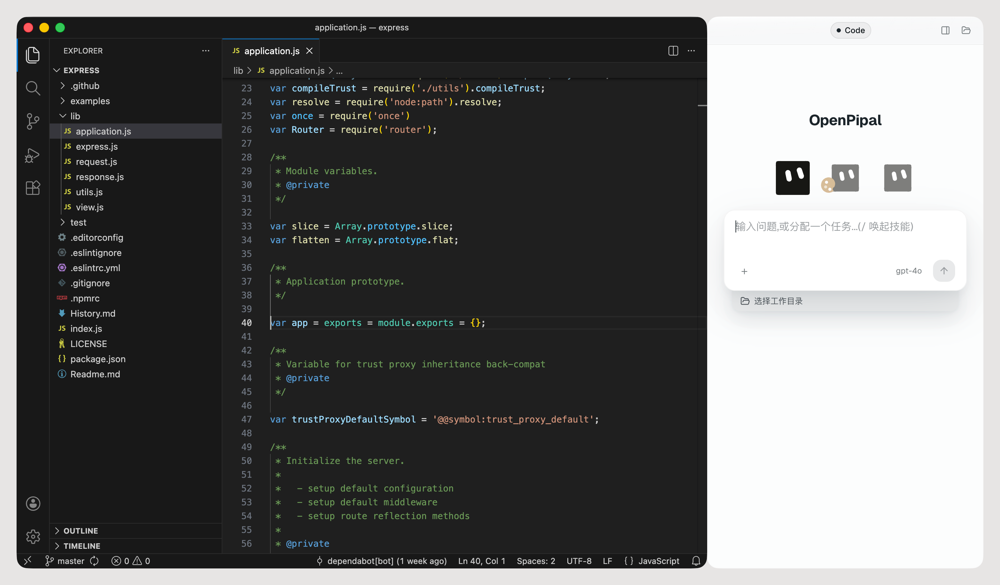

# OpenPipal

> 基于 [Pi](https://github.com/earendil-works/pi) 框架的开源可视化 Agent 客户端 · 无需命令行 · 连接模型即可开始

<p align="center">
  <a href="https://github.com/yuanlang12/OpenPipal/releases/latest">
    
  </a>
  <a href="https://github.com/earendil-works/pi"></a>
  <a href="LICENSE"></a>
</p>

<p align="center"><a href="README.md">English</a> · 简体中文</p>

<p align="center">
  
</p>

为每一项工作，定制一个 Agent。把一件活儿该怎么做教给 OpenPipal 一次，它就成了一个有自己
指令、记忆、技能和任务的 Agent——下次直接用，或者按计划在你不在的时候自己跑。

底层上，OpenPipal 是基于开源 [Pi](https://github.com/earendil-works/pi) Agent 框架的极简 Agent
客户端：Pi 负责跑 Agent 循环，OpenPipal 给它一个可视化的家——可保存复用的 Agent、插件、自动化、
记忆和浏览器侧栏；它接入的一切都是开放标准：Agent Client Protocol、MCP、Agent Skills、Agent Plugins。

**它不自带任何模型。** 每一次请求都从你自己的电脑直接发往你自己配置的 OpenAI 兼容端点：
你的密钥、你的服务商、你的账单。中间没有 OpenPipal 的服务器，因为根本就没有。

---

## 这一版包含什么

本仓库附带三个内置 Agent：**默认 OpenPipal Agent**、**设计助手**和**编码助手**。

---

## 它能做什么

- **专属 Agent**——任意对话点**保存为 Agent**，或者在「我的 Agents」页里新建：有自己的指令、
  长相、记忆和任务。一项工作，一个 Agent。
- **插件、技能、MCP 和命令行工具**——用标准插件（`plugin.json` + 技能 + MCP 服务器）扩展
  Agent；内置技能覆盖文档、PDF、幻灯片、表格，外加技能创建器和工具安装器，输入框里打 `/`
  就能用；任意 Model Context Protocol 服务器都能接，Context7 和 DeepWiki 是内置预设；你
  电脑上已经装好的命令行工具，比如 `gh`、`node`、`npm`，也能当工具用。
- **自动化**——运行一次，或让它持续工作：Cron 式定时或 Webhook 触发，每次新建会话或持续
  累积到同一会话。
- **子 Agent**——一项任务可以拆给多个子 Agent 去做，每个子 Agent 的完整对话都能展开查看。
- **作品**——Agent 产出的东西都收在一处；Visualizer 会在模型写的同时实时渲染卡片、图表、
  白板和 Mermaid 图。
- **长期记忆**——按 Agent 分开，默认关闭，存成你能直接读能改的 Markdown。
- **设计一次，在每个流程里复用**——支持开放的 [Agent Client Protocol](https://agentclientprotocol.com)
  的编辑器，把 OpenPipal 配成它的 agent server 就行（适配器随包带，启动命令在 **设置 → 连接**）；
  其他程序走本机 HTTP 接口。
- **浏览器侧栏**——同一个助手，在 Chrome / Edge / Brave 里也能用。
- **设计助手**——一句需求，直接做出海报、幻灯片这样的成品，再陪你一轮轮改。
- **编码助手**——在你的仓库里干活的内置 Agent（见下）。
- **应用跟随，想要再开**——默认关闭。在 **设置 → 应用** 里打开后，你切到哪个应用，OpenPipal
  就贴到它旁边；不想跟的应用可以单独关掉。

让模型成为核心，复杂按需出现：可控的上下文，只带这项工作真正需要的工具。

### 编码助手

在 Agent 切换器里选**编码助手**，它先问一句：在哪个仓库里干活？接下来它像个谨慎的新同事，
而不是什么都懂的万事通：

- **先认项目规矩，再动代码。** 工作目录里的 `AGENTS.md`（Codex、Cursor、Amp、Jules 都读的开放标准）、
  `AGENTS.override.md` 或 `CLAUDE.md` 会原文进入它的上下文。仓库里一份都没有时，它会用真跑过的命令
  起草一份 `AGENTS.md`——先给你看，你点头才写盘。
- **精确改动，改完跑项目自己的测试与构建**——不重写整文件。
- **这条会话能动什么，你说了算。**「只读」只看不改：读代码、搜索、看网页，不写文件、不跑命令。
  「自动审核」是默认档，要改文件或跑命令时问你一次。「完全允许」改文件、跑命令不再一次次问；
  删除、回滚、强推这类仍会问一次。
- **命令在 macOS 沙箱里跑**（Seatbelt，经 `@anthropic-ai/sandbox-runtime`），只许碰工作目录，
  凭据文件读不到。要拿你的 git 凭据连远端，按项目问你一次；沙箱里走 HTTPS。
- **报错截图和参考目录**可以一开始就给它——终端里的堆栈，或者另一个只读不改的仓库。

---

## 安装

桌面端提供 **macOS**（Apple Silicon 与 Intel）和 **Windows 10/11**（x64 与 ARM64）两个版本。
Windows 版是后来的那个，还没有代码签名，*Windows* 一节写了这在实际使用里意味着什么。

### macOS

1. 到 [Releases](https://github.com/yuanlang12/OpenPipal/releases/latest) 下载对应你 Mac 的
   `.dmg`（Apple Silicon 与 Intel 分开构建），把 `OpenPipal.app` 拖进 `Applications`。
2. **第一次打开会被 macOS 拦下。** 这些包用的是临时签名，没有 Apple 开发者证书，也没做
   公证；而且 macOS 15 之后，"右键 → 打开"那招已经不管用了。关掉提示框，去 **系统设置 →
   隐私与安全性**，往下滚到*安全性*那一段，在 OpenPipal 那行点**"仍要打开"**。
   嫌绕的话，终端里一条命令顶掉：

   ```sh
   xattr -dr com.apple.quarantine /Applications/OpenPipal.app
   ```

3. **权限只在功能用到时才会问你。** macOS 第一次用到时会弹窗，你也可以自己去
   **系统设置 → 隐私与安全性** 里把 OpenPipal 加进去：

   - **辅助功能** —— 只有打开应用跟随（设置 → 应用）才需要，面板靠它知道该贴在哪
   - **屏幕录制** —— 你让它看某个窗口时才用
   - **自动化** —— 聚焦、粘贴到你指定的那个应用
   - **麦克风** —— 只有用语音输入时才需要

   macOS 是按代码签名认 App 的，而临时签名每打一次包就变一次。所以装了新版之后，旧的授权
   条目可能失效，得删掉重新勾一遍。等有了公证版本，这道手续就没了。

### Windows

1. 到 [Releases](https://github.com/yuanlang12/OpenPipal/releases/latest) 下载
   `openpipal-<版本>-x64-setup.exe`（骁龙 / ARM 电脑下 `-arm64-` 那个），运行。
2. **SmartScreen 会拦一下。** 安装包没有代码签名，Windows 会提示"Windows 已保护你的电脑"。
   点**更多信息 → 仍要运行**。每次安装做一次就好。
3. **想让它跑命令，先装 [Git for Windows](https://git-scm.com/download/win)。** `bash` 工具
   用的是 Git Bash，和 Pi 命令行在 Windows 上一样。Windows 原生的活（cmdlet、注册表、`.ps1`
   脚本）走另一个 `powershell` 工具，不需要装任何东西。
4. **Windows 上没有系统沙箱。** macOS 上每条命令都在 Seatbelt 里跑，Windows 没有对应物，所以
   OpenPipal 会在每条命令前问你，并明说它将以你的账号权限执行；命令里写明了凭据文件
   （`.ssh`、`.aws`、`.env`、它自己的 `config.json`……）会被直接拒绝。"完全允许"档不再问普通
   命令，但删除、改写历史、强推这些照样问。
5. 应用跟随、窗口截图、粘贴到应用在 Windows 上不需要任何权限弹窗。面板是不透明的，不是磨砂
   玻璃：Windows 会在窗口失焦的那一刻把半透明窗口变成实色，而贴靠中的面板多数时间是失焦的。

### 接上模型

进 **设置 → 模型**，点**添加服务商**填 Base URL 和 API Key，再在它下面**添加模型**填模型名。
**测试连接**当场告诉你这一对通不通。

第一次启动会先放一段三屏的新手引导，可以跳过，之后随时能在 **设置 → 关于** 里重看。它只演示
能做什么，不替你配置任何东西，模型还是得按上面那步接上。

### 浏览器扩展（可选）

1. 从同一个 Release 下载 `openpipal-extension-*.zip`，解压到任意目录。
2. 在 Chrome / Edge / Brave 打开 `chrome://extensions`，开启右上角的**开发者模式**。
3. 点**加载已解压的扩展程序**，选中刚才那个目录。

扩展和桌面端共用同一个 AI 实例，通过 `localhost:3031` 通信，所以**桌面端必须开着**。

---

## 支持的模型服务

任何讲 OpenAI 兼容协议的服务都能接。内置预设：

| 服务商 | Base URL | 示例模型 |
|---|---|---|
| OpenAI | `https://api.openai.com/v1` | `gpt-4o` |
| DeepSeek | `https://api.deepseek.com` | `deepseek-chat`、`deepseek-reasoner` |
| OpenRouter | `https://openrouter.ai/api/v1` | `anthropic/claude-sonnet-4` |
| 硅基流动 | `https://api.siliconflow.cn/v1` | `Qwen/Qwen2.5-72B-Instruct` |
| 本地 Ollama | `http://localhost:11434/v1` | 你拉过的任意模型 |

---

## 数据都在你自己机器上

```
~/.openpipal/
├── config.json     # 模型预设与应用设置
├── memory/         # 长期记忆，按 Agent 分目录
├── outputs/        # 模型产出的文件
├── sessions-v4/    # 对话历史，只追加的 JSONL
├── conversations/  # 附件，以及旧版本留下的历史
└── skills/         # 你自己的技能
```

API Key 存在本机的 `config.json` 里，不会上传。删掉 `~/.openpipal/` 就等于清空一切。

---

## 从源码构建

需要 macOS 或 Windows、Node.js 22.19+ 和 npm。Windows 上在 PowerShell 或 Git Bash 里敲这些命令。

```bash
npm ci
npx electron-vite build
npx electron .                   # 运行构建产物
```

检查：

```bash
npx tsc --noEmit -p tsconfig.node.json   # 主进程
npx tsc --noEmit -p tsconfig.web.json    # 渲染层
npx vitest run                           # 单元测试
npx playwright test                      # 端到端
```

`npm run dev` 是常用的热重载开发模式。打包在 Mac 上用 `npm run build:mac`，在 Windows 上用
`npm run build:win`——这样出来的包未签名、未公证。Windows 安装包由 GitHub Actions 的
`Windows build` 工作流在 Windows 机器上原生打（x64 与 ARM64 各一台）；在 Mac 上直接打 Windows 包
只会带上 Mac 的原生二进制，除非走 `npm run build:win:cross`，它会先把 esbuild、sharp、canvas 的
`win32` 变体放进去。`npm run release:verify-windows -- --dist dist` 专门检查 Windows 包有没有犯这个错。

### 目录结构

| 路径 | 内容 |
|---|---|
| `src/main/` | Electron 主进程——Agent 运行时、工具、IPC、窗口停靠 |
| `src/renderer/` | React 界面，桌面端与浏览器侧栏共用 |
| `src/preload/` | 两者之间的 IPC 桥 |
| `src/shared/` | 双方共用的契约与多语言词条 |
| `openpipal-extension/` | Chrome 扩展 |
| `resources/skills/` | 内置技能 |
| `docs/` | 架构与安全说明 |

渲染层在桌面端走 preload IPC，在浏览器扩展里走 `:3031` 的 HTTP/SSE 垫片——
一套渲染层，两种传输。

---

## 常见问题

**macOS 提示无法验证开发者。** macOS 15 起"右键 → 打开"已经不管用了。去 **系统设置 → 隐私与安全性**
点"仍要打开"，或者用安装步骤里那条 `xattr` 命令。每次安装做一次就好。

**能换界面语言吗？** 能。**设置 → 外观 → 语言** 可以在简体中文和 English 之间切换，默认跟随系统，
改完立刻生效。

**它会一直跟着我的应用跑吗？** 不会。应用跟随默认关闭，想要的话在 **设置 → 应用** 里打开。

**免费吗？** 应用免费。模型用量由服务商直接向你计费，OpenPipal 既不经手钱也不经手密钥。

**能跑本地模型吗？** 能。Base URL 填 `http://localhost:11434/v1` 接 Ollama，模型名填你拉过的。

**Windows？** 有，见*安装*。和 macOS 是同一个应用，少了系统沙箱（命令改成逐条确认），也少了
`read_screen`（读别的应用里选中的文字要靠 UI Automation，还没接）。ARM64 版还少一个 PDF 页面
渲染器——它依赖的原生组件还没有 ARM64 版本——所以那类机器上 PDF 只按文字读。

**SmartScreen 提示"Windows 已保护你的电脑"。** 未签名安装包的正常现象：**更多信息 → 仍要运行**。

**Linux？** 没有构建也没有测过。代码是 Apache-2.0，欢迎 fork 后自行适配。

**扩展没反应。** 确认桌面端在运行，扩展需要它监听 `localhost:3031`。

---

## 参与

Bug 和想法欢迎提到 [Issues](https://github.com/yuanlang12/OpenPipal/issues)。
提 PR 前请看 [CONTRIBUTING.md](CONTRIBUTING.md)，安全问题的私下报告方式见
[SECURITY.md](SECURITY.md)。

我们也在 [LINUX DO](https://linux.do) 社区，欢迎过去聊。

---

## 许可

[Apache-2.0](LICENSE)。第三方组件及其许可证列在
[THIRD_PARTY_NOTICES.md](THIRD_PARTY_NOTICES.md)，内置技能的声明在
`resources/SKILLS-NOTICE.md`。
